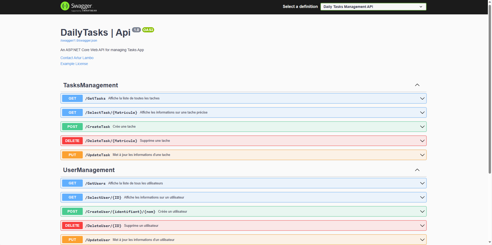

# Tasks_WEB-API
Mettre en place une API permettant d'exposer des dataset provenant d'une BD.
------------------------------------------------------------------------------------------------------------
## Mettre en place un swagger, le décrire et

## Les prerequis
- `dotnet new webapi -o Tasks_WEB-API`
- `dotnet add package Microsoft.EntityFrameworkCore.InMemory --version 5.0.10`
- `dotnet add package Microsoft.EntityFrameworkCore.Sqlite --version=5.0.10`
- `dotnet add package Microsoft.EntityFrameworkCore.Tools --version=5.0.10`
- `dotnet add package xunit --version=2.4.1`
- `dotnet add package xunit.runner.visualstudio --version=2.4.1`

## Tests 

- [ ] Tests unitaires
    > - [ ] Test de retour d'actions
    > - [ ] Test d'accès aux differents endpoints
    > - [ ] Test sur la logique du code

- [ ] Tests d'api
    > - [ ] Test des verbs HTTP 

- [ ] Tests de charge
    > - [ ] Test de performance quant à la montée en charge sur l'api

- [ ] Tests de Sécurité
    > - [ ] Test d'injection SQL
    > - [ ] Test d'attaques XSS

## Sécuriser l'api
- [ ] Mettre en place les authorisations (de base et/ou via un token de connexion)
- [ ] Sécuriser les endpoints

## Créer une base de données 
- [X] Créer un contexte de base de données en mémoire pour faire des tests sur l'api
- [X] Créer un modèle de données et les controleurs requis
- [ ] Utiliser SQLlite pour générer une base de données hébergée dans docker

## Representation

